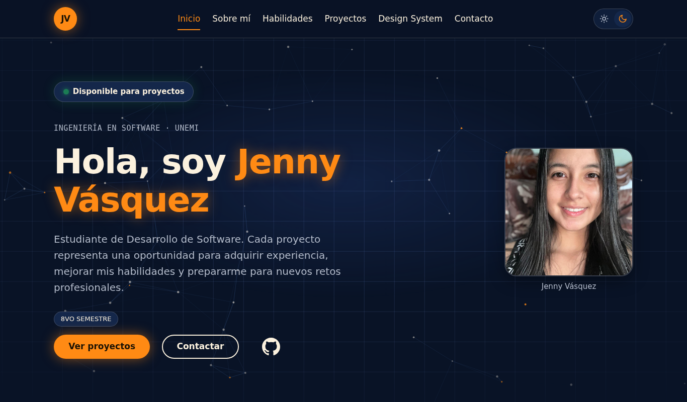
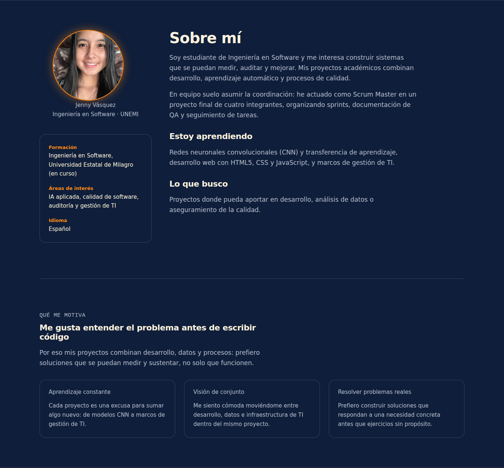
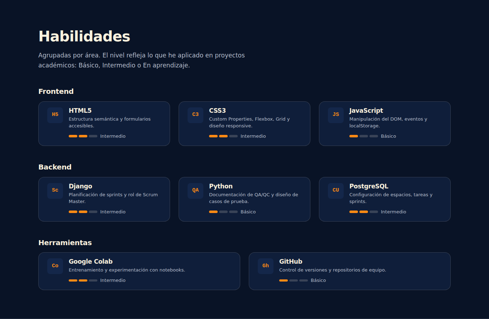
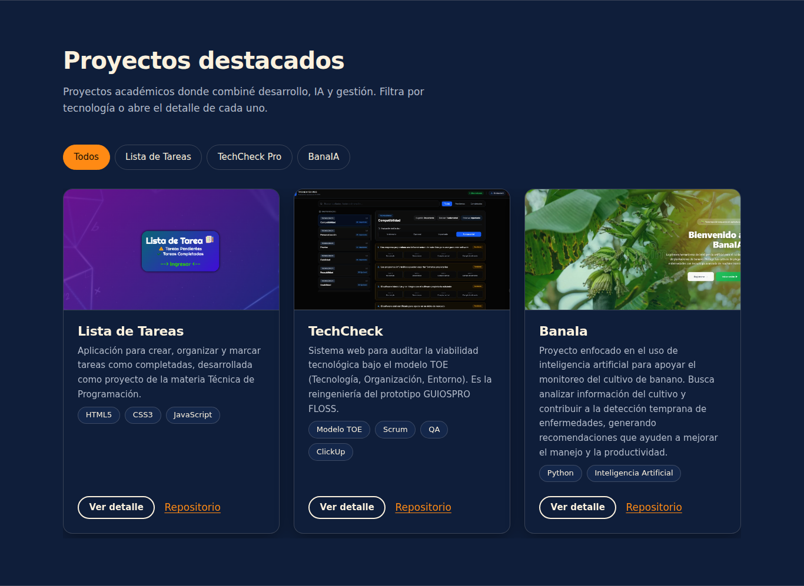
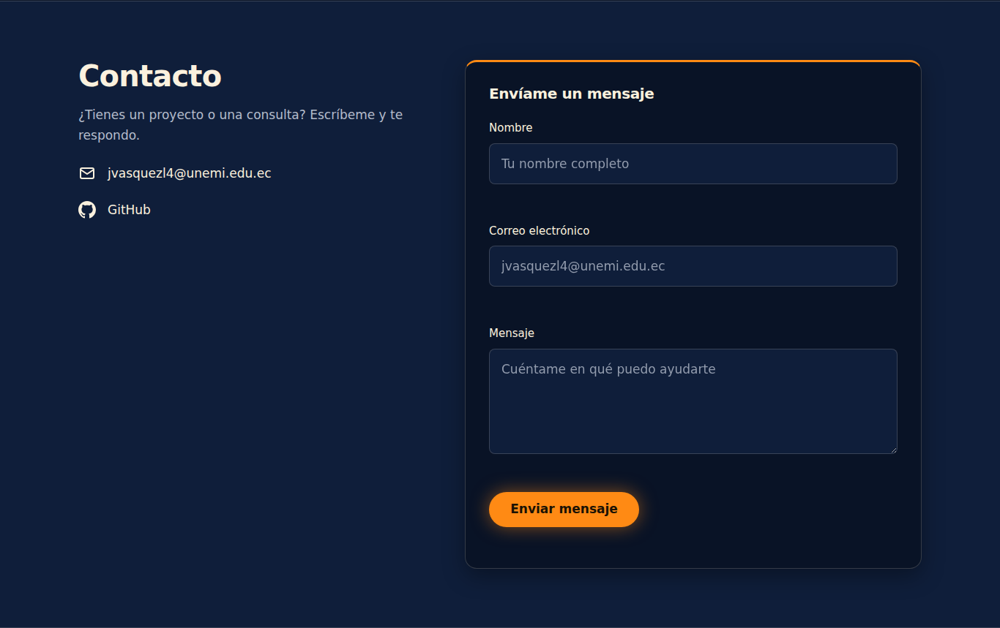
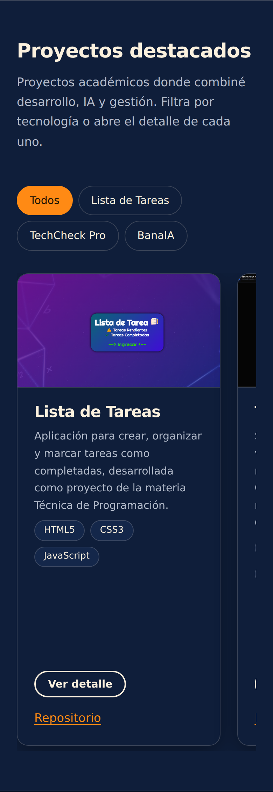

# Portafolio web — Jenny Vásquez

Portafolio personal de **Jenny Vásquez**, estudiante de Ingeniería en Software en la Universidad Estatal de Milagro (UNEMI), Ecuador. Presenta mi perfil, mis habilidades, mis proyectos académicos y un formulario para contactarme.

🔗 **Sitio publicado:** https://jenny2003-roc.github.io/Mi-Portafolio-Web/
📁 **Repositorio:** https://github.com/Jenny2003-roc/Mi-Portafolio-Web

---

## Descripción

Sitio estático de una sola página, construido sin frameworks ni librerías, con un **Design System propio** documentado dentro del mismo sitio (colores, tipografía, espaciado y componentes).

**Secciones:** Inicio · Sobre mí · Habilidades · Proyectos · Design System · Contacto

**Funcionalidades**

- Tema **claro/oscuro** (se recuerda con `localStorage`).
- Diseño **responsive** para móvil, tablet y escritorio, con menú colapsable.
- Navegación que resalta la sección visible.
- **Filtro de proyectos** y **ventana de detalle** (modal) de cada proyecto.
- **Formulario de contacto** con validación y envío real de correo (Web3Forms), con respaldo por `mailto`.
- Fondo animado de nodos en el inicio (`canvas`).
- Accesibilidad: HTML semántico, enlace "saltar al contenido", foco visible y respeto a `prefers-reduced-motion`.

## Proyectos destacados

| Proyecto | Descripción | Repositorio |
|---|---|---|
| **Lista de Tareas** | Aplicación web para crear, organizar y marcar tareas como completadas (materia Técnica de Programación). | [Ver](https://github.com/Jenny2003-roc/Lista-de-Tarea-T-cnica-de-Programaci-n) |
| **TechCheck Pro** | Sistema para auditar la viabilidad tecnológica bajo el modelo TOE (Tecnología, Organización, Entorno). | [Ver](https://github.com/Jenny2003-roc/TechCheckPro) |
| **BanaIA** | Herramienta de inteligencia artificial para el monitoreo del cultivo de banano y la detección temprana de enfermedades. | [Ver](https://github.com/juliojimenez200/proyecto-final) |

## Tecnologías

| Tecnología | Uso |
|---|---|
| **HTML5** | Estructura semántica de la página |
| **CSS3** | Custom Properties, Grid, Flexbox, media queries |
| **JavaScript (ES6+)** | Tema, menú, filtro, modal, validación y animación |
| **Google Fonts** | Tipografías Inter y JetBrains Mono |
| **Web3Forms** | Envío del formulario de contacto |
| **GitHub Pages** | Publicación del sitio |

## Instrucciones de visualización

**Opción 1 — Ver el sitio publicado**

Abre https://jenny2003-roc.github.io/Mi-Portafolio-Web/ en cualquier navegador.

**Opción 2 — Ejecutarlo en local**

1. Clona el repositorio:
   ```bash
   git clone https://github.com/Jenny2003-roc/Mi-Portafolio-Web.git
   ```
2. Abre la carpeta en VS Code.
3. Abre `index.html` con doble clic, o inicia la extensión **Live Server** (clic derecho en `index.html` → *Open with Live Server*).

No requiere instalar dependencias. El formulario de contacto necesita conexión a internet para enviar mensajes.

## Capturas del resultado

**Inicio (escritorio)**



**Sobre mí (escritorio)**



**Habilidades (escritorio)**



**Proyectos destacados (escritorio)**



**Contacto (escritorio)**



**Versión móvil**

 

## Estructura del proyecto

```
├── index.html
├── README.md
├── assets/
│   ├── img/
│   │   └── Yo.jpeg
│   ├── proyectos/
│   │   ├── ListadeTareas.png
│   │   ├── TechCheckPro.jpeg
│   │   └── BanaIA.jpeg
│   └── capturas/          # Capturas usadas en este README
├── css/
│   ├── tokens.css         # Variables: colores, tipografía, espaciado
│   ├── base.css           # Reset, tipografía y layout
│   ├── components.css     # Botones, cards, formulario, modal
│   └── sections.css       # Estilos por sección y responsive
└── js/
    └── script.js          # Interactividad
```

## Contacto

- Correo: jvasquezl4@unemi.edu.ec
- GitHub: https://github.com/Jenny2003-roc

## Autora

**Jenny Vásquez** — Ingeniería en Software, UNEMI © 2026